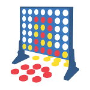

# Connect four challenge

## Rules

* No manual intervention is allowed
* Time control: max 1 second per move
* You play ten games against the same opponent
* Tournament format: [Swiss-system tournament](https://en.wikipedia.org/wiki/Swiss-system_tournament)

## Resources

* [Server](<https://github.com/lakermann/connect-four-challenge-server>)
* Clients
  * Java
  * Python
  * Elixir
* [Tournament Management](<https://kickertool.com>)

In the folders included in this repo you can find the results and logs of the played games.
